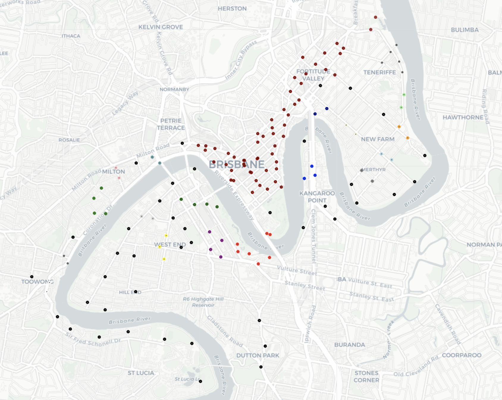

## Bike station clustering

Script to perform a clustering based on either the location of bike stations or other characteristics. 


*Chart : Result of the dbscan algorithm with parameters 0.25km and minimum 2 stations in a cluster*

### Usage
To run algorithm. 

```bash
docker build -t cluster_stations:master .

docker run -it cluster_stations:master
```

Can be also installed using `pip install --process-dependency-links -e .`   
And then runned using  `python3 main.py`

### Input
- Folder **data**

- Static geographical information of CityBike‘s stations in Brisbane (“Brisbane_CityBike.json”). 

### Output 
- Folder **output**
- csv files with the cluster number for each station. 

### Script
- Folder **cluster_project**

##### dbscan_clustering.py  
- Contains a function to cluster the points using a dbscan algorithm with haversine distance. 
- Allows to obtain a clustering based in the distance from one station to an other and to create groups of stations that are close to each other. 
- The algothim needs to be provided with parameters : the minimum distance between two station in a cluster, the minimum number of points to stat a cluster. 
- The main problem is that the distance calculated is the distance as the crow flies. It doesn't take into account the roads or lakes. 

##### adress_clustering.py
- Clustering using the adress similarities. 

##### plots.py
- Used to plot the stations on a map


